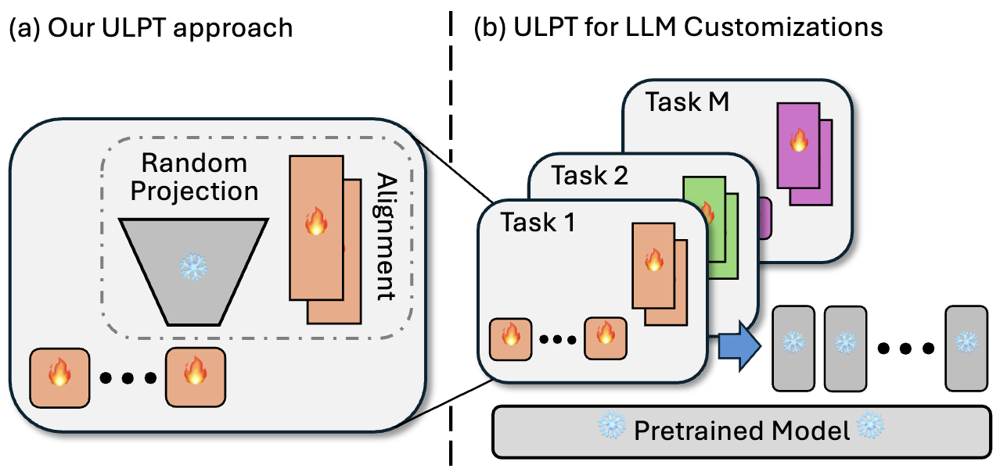

# ULPT: Prompt Tuning with Ultra Low-Dimensional Optimization

This repository provides the code for the paper titled **[ULPT: Prompt Tuning with Ultra Low-Dimensional Optimization](https://arxiv.org/abs/2502.04501)**. We leverage random projection matrix to significantly reduce training parameters for prompt tuning on LLM. 

<p align="center">
  
  <br />
</p>

## Extra Experiments
ULPT now supports Llama 3.2 models for math reasoning and code generation, please find the details in [Llama](Llama)

## Table of Contents
1. [Requirements and Installation](#requirements-and-installation)
2. [Quick Usage](#quick-usage)
3. [Run Experiments](#run-experiments)
4. [Support Models and Tasks](#support-models-and-tasks)
5. [Acknowledgement](#acknowledgement)

## Requirements and Installation

To install the required packages, run the following command:

```bash
pip install torch numpy scipy sklearn transformers==4.37.2 peft==0.11.1 datasets==2.16.1 accelerate==0.33.0
```

## Quick Usage
```bash
bash train.sh
```


## Run Experiments

```bash
MODEL=t5-base
MAX_LENGTH=256
MAX_STEPS=30000
PREFIX_LENGTH=100
R=2         #config the low-dimensional space
lr=6e-1
batch_size=16
TASK_NAME=sst2

CUDA_VISIBLE_DEVICES=0 python train.py \
    --peft_type PROMPT_TUNING_LODIM \
    --learning_rate ${lr} \
    --prefix_length ${PREFIX_LENGTH} \
    --task_name ${TASK_NAME} \
    --dataset_config_name en \
    --model_name_or_path ${MODEL} \
    --do_train \
    --do_eval \
    --do_predict \
    --per_device_train_batch_size ${batch_size} \
    --per_device_eval_batch_size ${batch_size} \
    --max_seq_length ${MAX_LENGTH} \
    --save_strategy steps \
    --evaluation_strategy steps \
    --max_steps ${MAX_STEPS} \
    --eval_steps 1000 \
    --save_steps 1000 \
    --warmup_steps 500 \
    --weight_decay 1e-5 \
    --load_best_model_at_end \
    --save_total_limit 1 \
    --output_dir saved_${MODEL}/${TASK_NAME}/lodim_r${R}_lr${lr}_pl${PREFIX_LENGTH}_st${MAX_STEPS}_bs${batch_size}_ml${MAX_LENGTH} \
    --lodim_r ${R}
```

## Support Models and Tasks

#### The following models have been tested:
- **Encoder-decoder models:** T5-small, base, large
- **Decoder-only models:** Bloomz-560m, 1.7b, 3b

**Note:** For decoder-only models, uncomment the post processing class `PostProcessor` in `src/postprocessors.py` for better post-processing.

#### The following tasks have been tested:
- **GLUE**: CoLA, SST-2, MRPC, STS-B, QQP, MNLI, QNLI, RTE
- **SuperGLUE:** CB, MultiRC,WiC, WSC
- **MRQA:** NewsQA, HotpotQA, NaturalQuestions, SearchQA, 
- **Others:** WinoGrande, Yelp, SciTail, PAWS


## Acknowledgement

This repository is built upon the following repositories:
- [DePT](https://github.com/ZhengxiangShi/DePT)
